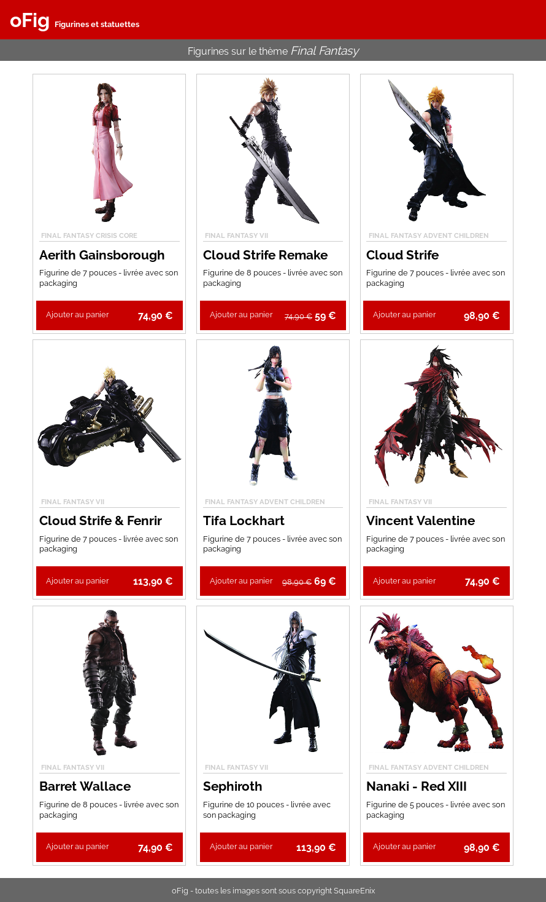
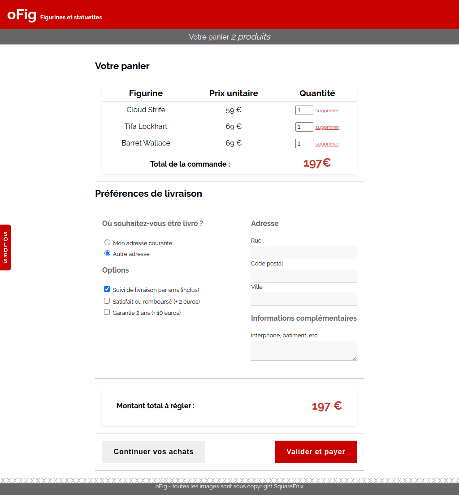

# Challenge oFig

Ce projet est un challenge que j'ai effectué au début de ma [formation O'Clock](https://oclock.io/formations/developpeur-web-fullstack-javascript), durant la première "saison".\
Il s'agissait de faire l'**intégration**, en **HTML et CSS**, d'une boutique de figurines (page de figurines et panier) pour laquelle on avait des images du visuel attendu.

Visuel de la page de figurines:\

Visuel du panier:\
